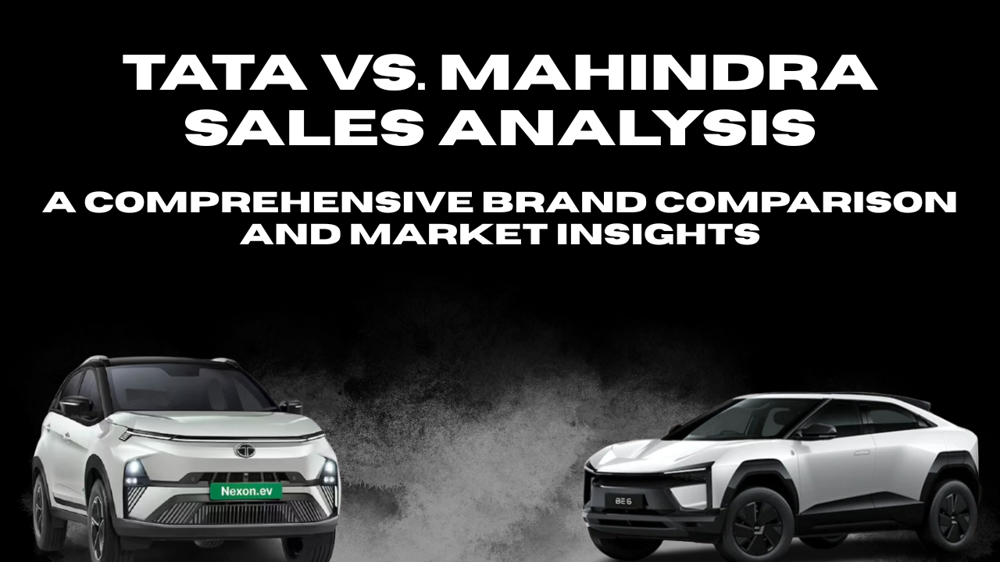
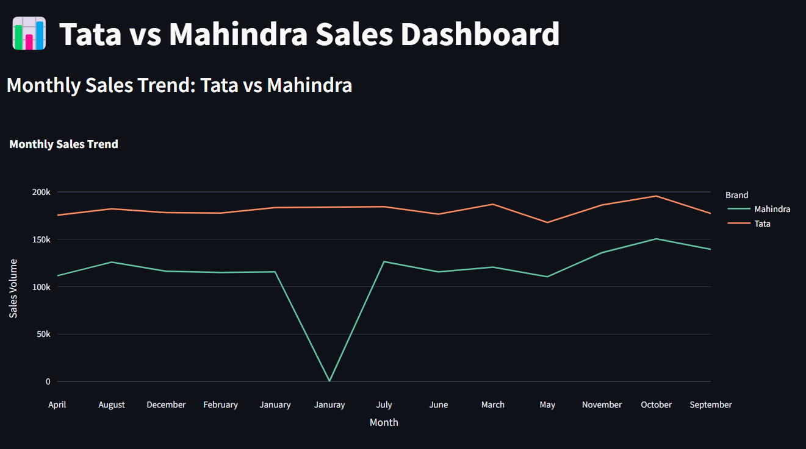
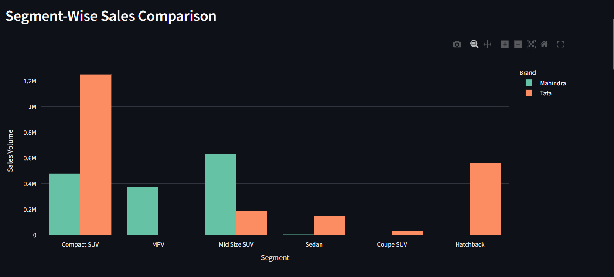
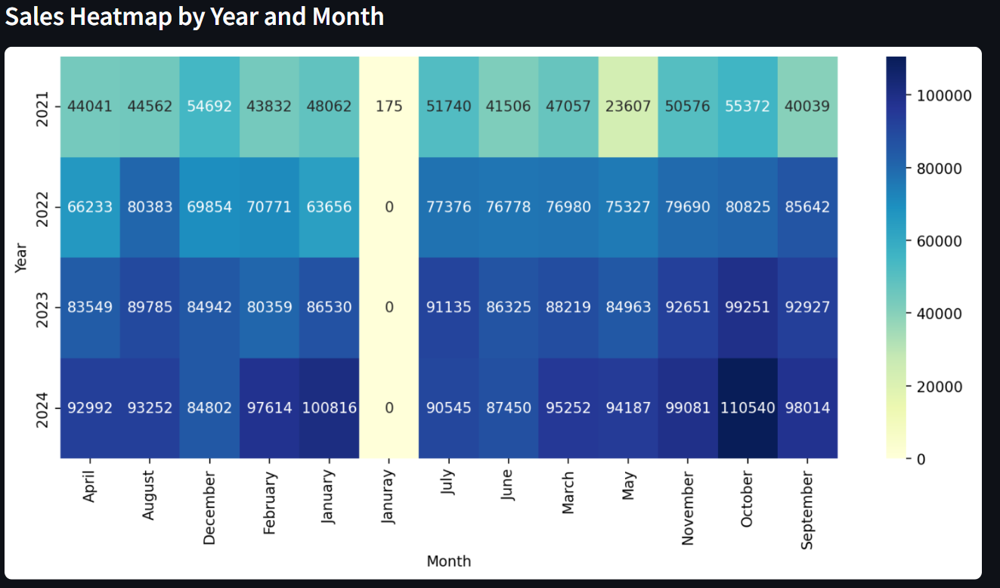

#  Sales Analysis: Mahindra vs. Tata  
### A Comprehensive Brand Comparison and Sales Insights



## Overview  
India’s automobile sector is rapidly evolving due to new technologies and shifting preferences.  
**Mahindra** and **Tata** are two strong domestic brands competing head-to-head in sales, innovation, and market share.

##  Project Goals
- Compare sales trends from 2021–2024
- Visualize market share by segment, engine type, and model
- Generate investment insights using data analysis

##  Tools Used
- Python, Pandas, Matplotlib, Seaborn
- Streamlit for interactive dashboards
- Excel data processing

##  How to Run

### ▶ Jupyter Notebook:
```bash
jupyter notebook Tata_vs_Mahindra.ipynb
```

### ▶ Streamlit Dashboard:
```bash
streamlit run streamlit_dashboard.py
```

##  Sample Charts
  



Made by Priyansh Golwalkar 
